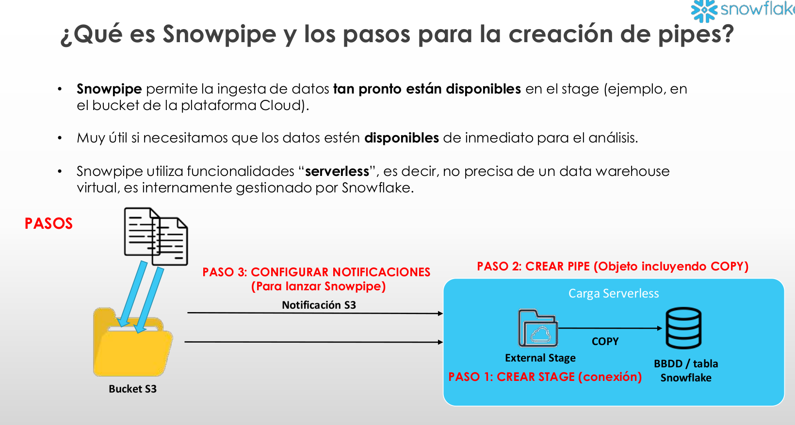
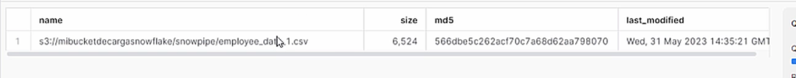
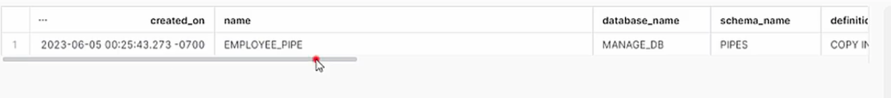
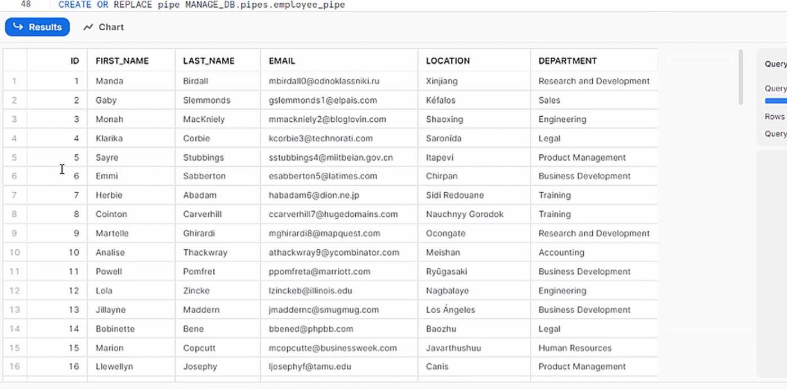
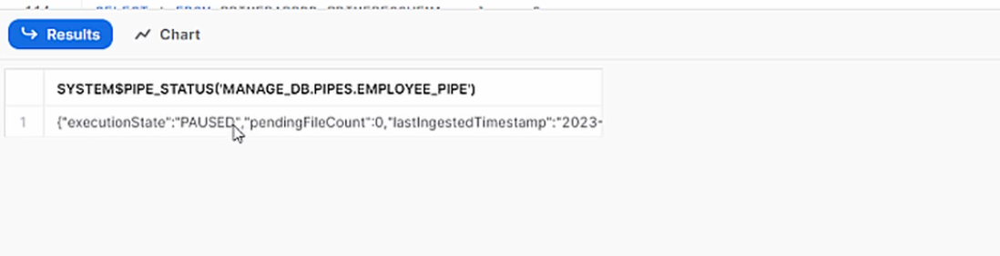
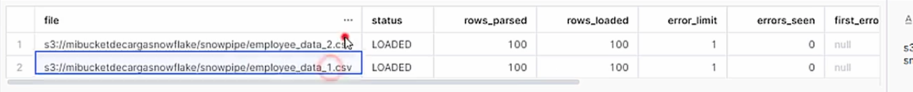
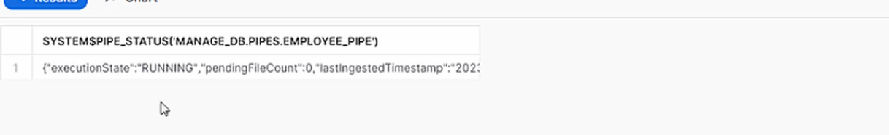
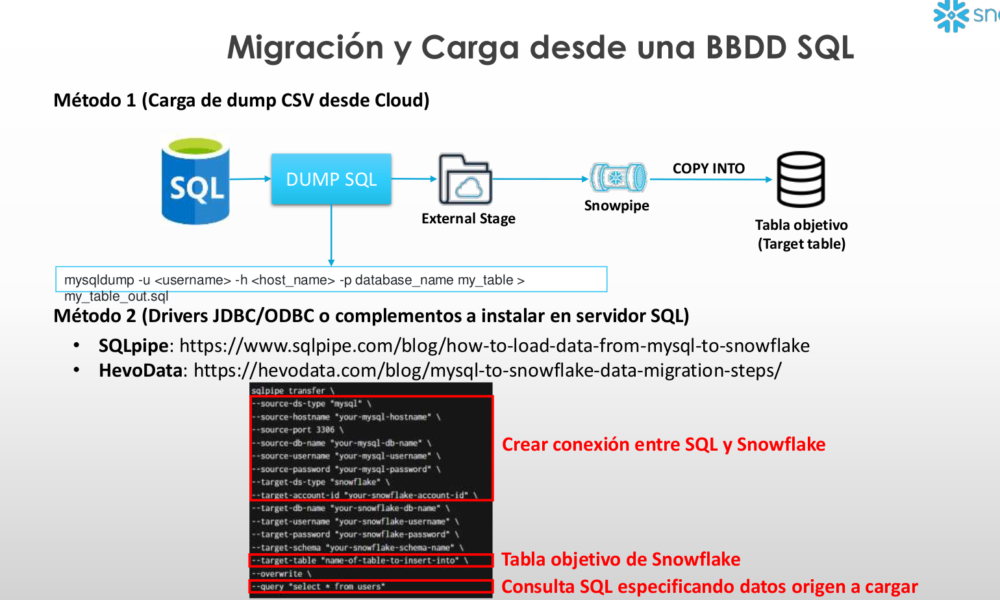

# 5-Snowpipe
1. [¿Qué es Snowpipe y los pasos para la creación de pipes?](#schema1)
2. [Creación de stage para Snowpipe](#schema2)
3. [Creación del pipe](#schema3)
4. [Configurar el pipe y las notificaciones](#schema4)
5. [Gestión de pipes](#schema5)
6. [Migración y Carga desde una BBDD SQL (Método Cloud y Método complemento pipe)](#schema6)


<hr>

<a name="schema1"></a>

## 1. ¿Qué es Snowpipe y los pasos para la creación de pipes?

**¿Qué es Snowpipe?**

Snowpipe es un servicio de ingestión de datos en Snowflake que permite cargar datos de manera continua y casi en tiempo real desde una variedad de fuentes de datos. Está diseñado para ser altamente escalable y manejado automáticamente, lo que minimiza la necesidad de intervención manual en el proceso de carga de datos.

**Características Principales**
- Carga Continua: Snowpipe permite la carga continua de datos, lo que significa que los datos se cargan en Snowflake a medida que se hacen disponibles en la fuente de datos.

- Automatización: Snowpipe puede configurarse para que detecte automáticamente nuevos archivos de datos en ubicaciones de almacenamiento especificadas (como Amazon S3, Azure Blob Storage, o Google Cloud Storage) y los cargue en las tablas de Snowflake.

- Escalabilidad: Snowpipe está diseñado para manejar cargas de trabajo variables, ajustándose automáticamente para procesar los datos de manera eficiente sin necesidad de gestión manual de la infraestructura.

- Minimización de Latencia: El servicio está optimizado para minimizar la latencia, proporcionando casi tiempo real de carga de datos en Snowflake.

- Monitoreo y Alertas: Snowpipe ofrece capacidades de monitoreo y alertas para que los usuarios puedan supervisar el estado de las cargas de datos y recibir notificaciones en caso de errores o problemas.

**Cómo Funciona Snowpipe**

El flujo típico de trabajo de Snowpipe incluye los siguientes pasos:

1. Configuración de la Fuente de Datos: Los datos a cargar deben estar disponibles en una ubicación de almacenamiento compatible, como Amazon S3, Azure Blob Storage, o Google Cloud Storage.

2. Definición del Snowpipe: Se define un pipe en Snowflake, que es un objeto que especifica cómo deben cargarse los datos desde la ubicación de almacenamiento a las tablas de Snowflake. Este pipe incluye información sobre la ubicación de los archivos de datos y la tabla de destino en Snowflake.

3. Notificación de Nuevos Datos: Snowpipe puede configurarse para recibir notificaciones automáticas (por ejemplo, mediante Amazon SNS/SQS, Azure Event Grid, o Google Pub/Sub) cuando nuevos archivos de datos están disponibles en la ubicación de almacenamiento.

4. Ejecución de la Carga de Datos: Cuando se detecta un nuevo archivo de datos, Snowpipe lo procesa y carga los datos en la tabla de destino en Snowflake.

5. Validación y Monitoreo: Snowpipe valida los datos cargados y ofrece herramientas para monitorear el proceso de carga, asegurando que los datos se ingresen correctamente y proporcionando alertas en caso de problemas.


<hr>

<a name="schema2"></a>

## 2. Creación de stage para Snowpipe
**1.  Creación de la tabla**
```sql
CREATE OR REPLACE TABLE PRIMERABBDD.PRIMERESQUEMA.employees (
  id INT,
  first_name STRING,
  last_name STRING,
  email STRING,
  location STRING,
  department STRING
  )
```

**2. Creación objeto formato fichero**
```sql
CREATE OR REPLACE file format MANAGE_DB.file_formats.csv_fileformat
    type = csv
    field_delimiter = ','
    skip_header = 1
    null_if = ('NULL','null')
    empty_field_as_null = TRUE;
```

    
**3. Crear stage con objeto integración y objeto formato fichero**
```sql
CREATE OR REPLACE stage MANAGE_DB.external_stages.csv_folder
    URL = 's3://mibucketdecargasnowflake/snowpipe'
    STORAGE_INTEGRATION = s3_int
    FILE_FORMAT = MANAGE_DB.file_formats.csv_fileformat 
``` 

**4. Visualizar los ficheros que hay en el stage**
```sql
LIST @MANAGE_DB.external_stages.csv_folder  
```


**5. Creación de un esquema para organizar los pipes**
```sql
CREATE OR REPLACE SCHEMA MANAGE_DB.pipes
```


<hr>

<a name="schema3"></a>

## 3. Creación del pipe

Hacer los pasos anteriores.

**6. Definir el pipe**
```sql
CREATE OR REPLACE pipe MANAGE_DB.pipes.employee_pipe
auto_ingest = TRUE
AS
COPY INTO PRIMERABBDD.PRIMERESQUEMA.employees
FROM @MANAGE_DB.external_stages.csv_folder  
```
**AUTO_INGEST = TRUE:**

- AUTO_INGEST: Esta opción habilita la ingestión automática de datos. Cuando está configurado en TRUE, Snowpipe monitoriza la ubicación de almacenamiento (en este caso, un stage en S3) y automáticamente ingesta nuevos archivos tan pronto como están disponibles.

- Detección Automática: Con AUTO_INGEST = TRUE, Snowpipe detectará automáticamente los nuevos archivos que se suban al bucket de S3 especificado.

**7. Descripción del pipe**
```sql
DESC pipe employee_pipe
```


<hr>

<a name="schema4"></a>

## 4. Configurar el pipe y las notificaciones
AWS- Bucket-Nuestro bucket-Event Notificationes- Crear- Rellenar campos- Cola SQS- datos del desc pipe.
```sql
SELECT * FROM PRIMERABBDD.PRIMERESQUEMA.employees    
```


<hr>

<a name="schema5"></a>

## 5. Gestión de pipes
- Descripción de pipes
```sql
DESC pipe MANAGE_DB.pipes.employee_pipe;

SHOW PIPES;

SHOW PIPES like '%employee%'

SHOW PIPES in database MANAGE_DB

SHOW PIPES in schema MANAGE_DB.pipes

SHOW PIPES like '%employee%' in Database MANAGE_DB
```

- Modificar pipe (alterar stage o file format)

1. Preparación de la tabla 2
```sql
CREATE OR REPLACE TABLE PRIMERABBDD.PRIMERESQUEMA.employees2 (
  id INT,
  first_name STRING,
  last_name STRING,
  email STRING,
  location STRING,
  department STRING
  )
```
2. Pausar pipe
```sql
ALTER PIPE MANAGE_DB.pipes.employee_pipe SET PIPE_EXECUTION_PAUSED = true
```

3. Verificar que el pipe está en pausa y pendingFileCount = 0 
```sql
SELECT SYSTEM$PIPE_STATUS('MANAGE_DB.pipes.employee_pipe') 
```



4. Recrear pip y cambiar definición en el COPY
```sql
CREATE OR REPLACE pipe MANAGE_DB.pipes.employee_pipe
auto_ingest = TRUE
AS
COPY INTO PRIMERABBDD.PRIMERESQUEMA.employees2
FROM @MANAGE_DB.external_stages.csv_folder  

ALTER PIPE  MANAGE_DB.pipes.employee_pipe refresh
```

5. Listar ficheros en el stage
```sql
LIST @MANAGE_DB.external_stages.csv_folder  

SELECT * FROM PRIMERABBDD.PRIMERESQUEMA.employees2
```

6. Tabla vacía, recargar manualmente los ficheros que estaban en el bucket previamente
```sql
COPY INTO PRIMERABBDD.PRIMERESQUEMA.employees2
FROM @MANAGE_DB.external_stages.csv_folder  
```



7. Reactivar pipe
```sql
ALTER PIPE MANAGE_DB.pipes.employee_pipe SET PIPE_EXECUTION_PAUSED = false
```
8. Verificar que el pipe está activo de nuevo
```sql
SELECT SYSTEM$PIPE_STATUS('MANAGE_DB.pipes.employee_pipe')
```


<hr>

<a name="schema6"></a>


## 6. Migración y Carga desde una BBDD SQL (Método Cloud y Método complemento pipe)

